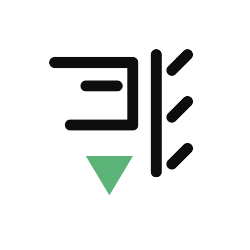
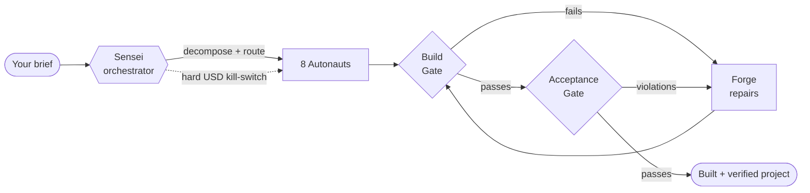
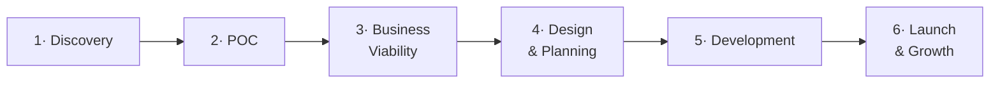
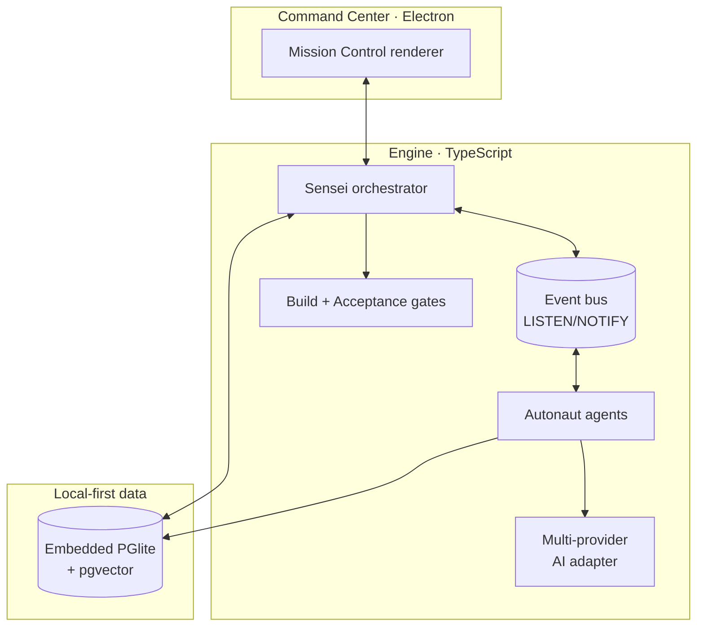

<div align="center">

<picture>
  <source media="(prefers-color-scheme: dark)" srcset="assets/branding/png/kageops-logo-dark-bg-512.png">
  
</picture>

https://github.com/user-attachments/assets/6d473f76-538c-45c5-b853-245f50a98d44
### An open-source, autonomous AI dev team — from one-line brief to shipped product.

**Sensei** orchestrates eight specialist agents (the *Autonauts*) through a full
six-phase product lifecycle: discover → design → build → **verify** → deploy.
Runs on your laptop. Zero Docker. Your keys, your code, your machine — with a
hard USD kill-switch you control.

[](LICENSE)
[](#quality--the-part-nobody-else-ships)
[](tsconfig.json)
[](#quickstart)
[](CONTRIBUTING.md)

[Quickstart](#quickstart) · [How it works](#how-it-works) · [The Autonauts](#meet-the-autonauts) · [Why it's different](#why-kageops-is-different) · [Open core](#whats-in-this-repo-open-core) · [Contributing](CONTRIBUTING.md)

</div>

---

## The 30-second pitch

You describe what you want. **Sensei** — the orchestrator — decomposes it into
tasks and routes each to the specialist best suited for it. Eight agents plan,
write code, **run the tests, fix what fails**, and hand you a built, verified
project — with a live activity feed the whole way and a hard budget cap you set.

> **Not another chat wrapper.** KageOps is a real orchestration engine: task
> decomposition, phase gates, a build gate that actually runs `npm install/build/test`,
> an acceptance gate that checks the output against your brief, tiered
> retry-with-repair, and non-negotiable cost guardrails.

```bash
git clone https://github.com/hmanoor/kageops-core.git && cd kageops-core
npm install && npm run build

# The "wow" — preview a full run. Decomposition + routing. Zero AI spend.
npx tsx src/cli/headless-runner.ts --dry-run \
  --name "TaskFlow" \
  --description "A kanban board with drag-and-drop columns and localStorage. Include #board, #add-task, #columns."
```

<details>
<summary><b>👉 What the dry-run prints (click to expand)</b></summary>

```
═══ DRY-RUN PLAN (no AI calls, no spend) ═══
  Project:        TaskFlow
  Simple-app:     NO

  Phase plan:
    discovery              full: ~4 task(s)
    poc                    full: ~4 task(s)
    business-viability     full: ~4 task(s)
    design-planning        full: ~4 task(s)
    development            full: ~8 task(s)
    launch-growth          full: ~4 task(s)

  Total tasks:    ~28
  Estimated cost by preset:
    openrouter_budget (DeepSeek/Gemini)      ~$0.13
    ollama (local)                           ~$0.00
═══════════════════════════════════════════
```

It shows the exact plan Sensei would execute — every phase, every task, and
which Autonaut each is routed to — **without making a single paid API call.**
</details>

Ready for real? Point it at a provider and lift the cap:

```bash
export OPENROUTER_API_KEY=sk-...            # or ANTHROPIC_API_KEY, or Ollama (fully local), …
KAGEOPS_PRESET=openrouter_budget KAGEOPS_MAX_RUN_USD=0.50 \
  npm run run:headless -- --name "TaskFlow" --description "..."
```

Prefer a GUI? `npm run dev` launches the **Command Center** — Mission Control for
watching agents work, intercepting tasks, and reviewing output live.

---

## How it works

**Sensei never does task work itself — it orchestrates.** It decomposes the
brief, routes each task to the right specialist, runs the phase gates, and drives
the retry-and-repair loop when something fails.



Every project flows through a **six-phase lifecycle**, each phase gated by your
trust level:



After development, two automated gates run before anything is called "done":

| Gate | What it does |
|------|--------------|
| **BuildVerificationGate** | Runs the *real* `npm install` → `build` → `test`. No green build, no pass. |
| **AcceptanceGate** | Checks the output against your brief (required elements, preview-URL reachability), with two-tier MUST/SHOULD severity. On failure it spins a repair task for **Forge** and retries. |

---

## Built with KageOps

Real apps the agents built end-to-end — from a brief to a deployed site:

| Project | What it is | Live |
|---------|-----------|------|
| **DevPulse** | A full SaaS — Clerk auth + Stripe billing + Neon Postgres, deployed to Vercel | **[devpulse.kageops.dev](https://devpulse.kageops.dev)** |
| **Prism** | A CSS design toolkit / playground | **[prism.kageops.dev](https://prism.kageops.dev)** |

<!-- Screenshots: drop PNGs at assets/showcase/devpulse.png + assets/showcase/prism.png,
     then uncomment the gallery below.
<p align="center">
  <a href="https://devpulse.kageops.dev"></a>
  &nbsp;
  <a href="https://prism.kageops.dev"></a>
</p>
-->

---

## Meet the Autonauts

Nine specialists. Each an expert in one slice of the lifecycle — because eight
sharp tools beat one fuzzy one.

| Agent | Role | Owns |
|-------|------|------|
| 🧭 **Sensei** | Orchestrator | Decomposition, routing, phase gates, retries — never writes task code itself |
| 🔍 **Scout** | Strategist | Research, discovery, concept briefs, cost estimates |
| 📐 **Blueprint** | Architect | System + data design |
| 🎨 **Pixel** | Designer | UI / UX |
| 🔨 **Forge** | Engineer | Implementation + repair |
| 🔐 **Cipher** | Data specialist | Schemas, migrations, data flows |
| 🛡️ **Aegis** | Platform engineer | Build, deploy, preview |
| 👁️ **Vigil** | Quality guardian | Tests + review |
| 📣 **Herald** | Marketer | Copy + launch assets |

---

## Why KageOps is different

- 🛑 **Agents that spend money answer to a kill-switch.** Every real run requires
  an explicit `KAGEOPS_MAX_RUN_USD` cap. A budget poller checks spend every 3s and
  **cancels the run** before it blows past. Per-task call caps and a zombie-guard
  back it up. Always `--dry-run` first.
- 🧪 **It verifies its own work.** The build gate runs your actual toolchain; the
  acceptance gate checks the output against the brief. Failures trigger a bounded
  retry-with-repair loop, not a shrug.
- 🏠 **Local-first, zero-Docker.** An embedded Postgres (PGlite, WASM) boots
  in-process on first run. No database to install, no containers, no cloud
  dependency. Your code never leaves your machine.
- 🔌 **Bring your own provider.** Claude (API + CLI), OpenRouter, **Ollama
  (fully local, $0)**, OpenAI, Gemini — swap with a preset. Your provider bill
  stays on your own account.
- 🎛️ **Watch and steer.** The Command Center desktop app streams a live activity
  feed; intercept, approve, or redirect tasks as they run.

### Multi-provider by design

| Provider | Mode | Cost |
|----------|------|------|
| **Claude** | API or local CLI | Metered / subscription |
| **OpenRouter** | API (DeepSeek, Gemini, GPT, …) | Cheapest metered |
| **Ollama** | Fully local | **$0** |
| **OpenAI** | API | Metered |
| **Gemini** | API | Metered |

---

## Quality — the part nobody else ships

- **6,300+ tests** passing across 290+ files, `tsc --strict` clean throughout.
- Deterministic guardrails: budget-kill, per-task caps, zombie-guard, path-traversal
  prevention on all agent file I/O, parameterized SQL only.
- CI runs build · test · lint · secret-scan (gitleaks + a home-grown scanner) on
  every PR.

---

## Architecture



| Layer | Tech |
|-------|------|
| Desktop app | Electron 34 + TypeScript |
| Engine | Sensei orchestrator + 8 agents, event bus (Postgres LISTEN/NOTIFY) |
| Database | Embedded PGlite (default) · external Postgres 16 + pgvector (opt-in) |
| AI | Multi-provider adapter (Claude / OpenRouter / Ollama / OpenAI / Gemini) |
| CLI | Headless runner (`--dry-run`, budget caps, resume) |
| Tests | Vitest · `tsc --strict` |

See [`docs/architecture/`](docs/architecture/) for the full picture.

---

## What's in this repo (open core)

KageOps is **open-core**. This repository is the engine and everything you need
to run it locally — under **AGPL-3.0**, free forever:

- ✅ Sensei orchestrator, the 8 Autonauts, the agent framework
- ✅ Task decomposition, routing, phase gates, build + acceptance gates
- ✅ Embedded PGlite database, event bus, headless CLI runner
- ✅ The Command Center desktop UI
- ✅ Multi-provider AI adapter + cost guardrails + APO (prompt optimization)

The commercial **KageOps Cloud** layer — managed cloud compute, team
collaboration, hosted identity, billing, and outbound connectors — lives in a
separate private repository. The boundary is documented in
[OPEN-CORE.md](OPEN-CORE.md), and **there are zero `open → commercial` imports**;
the engine runs fully standalone. What you pay for is the hosted business, never
the engine.

---

## Quickstart

**Requires Node 20+.** No Docker, no database setup.

```bash
git clone https://github.com/hmanoor/kageops-core.git
cd kageops-core
npm install
npm run build

# 1. Preview (no spend)
npx tsx src/cli/headless-runner.ts --dry-run --name "MyApp" --description "..."

# 2. Real run (budget-capped)
export OPENROUTER_API_KEY=sk-...
KAGEOPS_PRESET=openrouter_budget KAGEOPS_MAX_RUN_USD=0.50 \
  npm run run:headless -- --name "MyApp" --description "..."

# 3. Or the desktop Command Center
npm run dev
```

> **Cost safety is built in.** Real runs require an explicit `KAGEOPS_MAX_RUN_USD`
> cap; the budget-kill poller cancels the run if spend approaches it.

## How-to guides

Short narrated screen-captures of the **real app** — no mockups. They're produced
by an automated pipeline that drives the actual UI and records it, so every guide
is re-cut when the interface changes and can't go stale. Index: **[docs/how-to](docs/how-to/README.md)**.

**Episode 01 — First launch & the setup wizard** (1:55). Model presets and their
cost trade-offs, trust levels, keychain-stored API keys, and the per-run budget
kill-switch — ending at your first New Project screen.

https://github.com/user-attachments/assets/ce1a32b3-4419-4181-b78b-21ff2312cdbe

---

## Contributing

We'd love your help. Read [CONTRIBUTING.md](CONTRIBUTING.md) — dev setup,
conventional-commit + test-coverage bars, and the one-time [CLA](CLA.md) sign-off
(automated on your first PR). All participation is governed by our
[Code of Conduct](CODE_OF_CONDUCT.md).

## Security

Found a vulnerability? **Don't** open a public issue — see [SECURITY.md](SECURITY.md)
for private disclosure via GitHub Security Advisories.

## Acknowledgments

KageOps is built on ideas from the open-source community. With thanks to:

- **[graphify](https://github.com/safishamsi/graphify)** — inspiration + the engine behind the in-app **Code Graph** (turn any input into a navigable knowledge graph).
- **[Agent Lightning](https://github.com/microsoft/agent-lightning)** (Microsoft) — inspiration for **APO**, KageOps's opt-in Automatic Prompt Optimization loop.
- **[caveman](https://github.com/juliusbrussee/caveman)** (Julius Brussee) — inspiration for **Caveman Mode**, our terse agent-to-agent prompting that trims inter-agent tokens ~65%.

These projects shaped how KageOps works; any rough edges are ours, not theirs.

## License

[AGPL-3.0](LICENSE) © KageOps. Contributions are accepted under the project
[CLA](CLA.md), which preserves the option to offer KageOps under a commercial
license alongside the AGPL open core.

<div align="center">
<sub>Built by the KageOps team · <a href="https://kageops.dev">kageops.dev</a> · <a href="https://kageops.ai">kageops.ai</a></sub>
</div>
